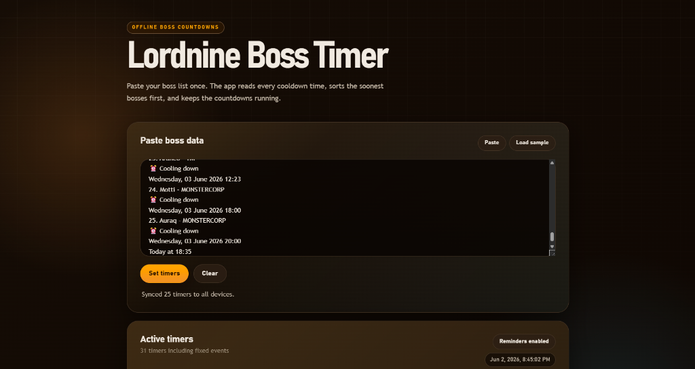
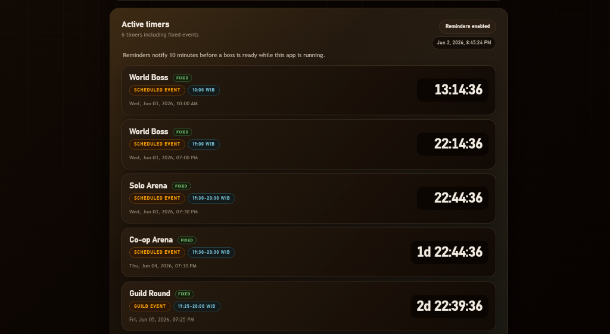

# Lordnine Boss Timer

Web-based boss timer app. Paste the copied boss list, tap **Set timers**, and the app turns each cooldown timestamp into a sorted countdown. Shared timer writes require PIN `4444` and sync through the small `/api/timers` backend.

The app runs as a local web app/PWA from the files in this repository.

## Screenshots





## Run the web app

```bash
bun run start
```

Open <http://127.0.0.1:4173> in your browser.

## VPS / PWA checklist

- Serve the app from a real HTTPS domain. Browser notifications and service workers work on `localhost`, but deployed HTTP/IP URLs are not secure contexts.
- After deploy, reload once so `service-worker.js` updates to the latest cache.
- Click **Enable reminders**, then **Test reminder**. If permission is enabled but no popup appears, check OS notification settings for the browser/PWA.
- Keep the web app or installed PWA running for 10-minute and 5-minute boss warnings. This is a web reminder, not a native Android/Windows alarm.

## Input format

```text
📋 All Boss Timers
1. Shuliar - KARAKAZA
⏰ Cooling down
Wednesday, 20 May 2026 08:07
2. Larba - KARAKAZA
⏰ Cooling down
Wednesday, 20 May 2026 08:09
```

The parser looks for numbered lines in the form `Boss Name - Server`, then reads the cooldown date in the next few lines.

## Development

```bash
bun test
bun run start
```
